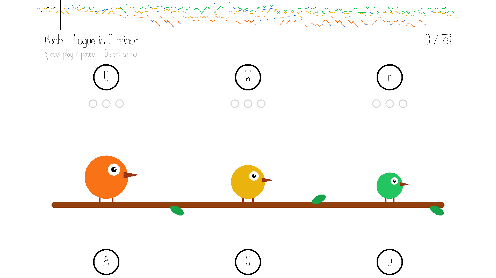

# Three Birds Sing Bach

Author: Deming Xu

Design: 

Three birds sing the three voices of Bach's C minor fugue (BWV 847). You have to pick out, by ear, the moments when a voice sings the do-si-do motif or runs up or down a scale, and answer each pattern with a key press on the last note. The picture only shows what has already been heard, never when to press.

This is a game similar to Rhythm Heaven, except that the melodies are drawn from classical music rather than being composed from scratch, and it utilizes the symmetry and patterns found in Bach's compositions.

Screen Shot:

How To Play:

- Space: play / pause. Enter: watch a demo.
- Click the piano roll at the top to jump anywhere in the fugue.
- Each bird has two keys: Q W E (left, middle, right bird) for do-si-do patterns, A S D for scale patterns.

Sounds: everything is synthesized in `PlayMode.cpp` at start-up (a sawtooth-like wavetable for the voices, an octave-only bell for the confirmations), no audio files. The score data in `chart.hpp` is generated by `build.py` from the Humdrum kern encoding of the fugue in the [humdrum-tools/bach-wtc](https://github.com/humdrum-tools/bach-wtc) repository.

Build: `node Maekfile.js` with `nest-libs` as a sibling folder (see NEST.md), then `./dist/game`.

This game was built with [NEST](NEST.md).
